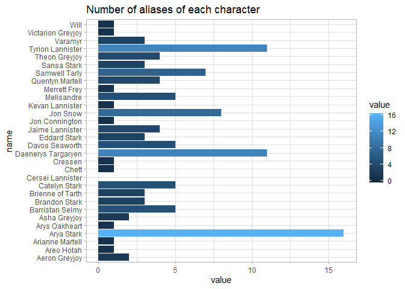

This is my first GitHub experience!

Loaad required libraries

```r
library(repurrrsive)
library(purrr)
library(magrittr)
library(tibble)
library(ggplot2)
```

List all the GOT characters.

```r
my_characters <- map_chr(got_chars, "name")
my_characters
```

```
##  [1] "Theon Greyjoy"      "Tyrion Lannister"   "Victarion Greyjoy" 
##  [4] "Will"               "Areo Hotah"         "Chett"             
##  [7] "Cressen"            "Arianne Martell"    "Daenerys Targaryen"
## [10] "Davos Seaworth"     "Arya Stark"         "Arys Oakheart"     
## [13] "Asha Greyjoy"       "Barristan Selmy"    "Varamyr"           
## [16] "Brandon Stark"      "Brienne of Tarth"   "Catelyn Stark"     
## [19] "Cersei Lannister"   "Eddard Stark"       "Jaime Lannister"   
## [22] "Jon Connington"     "Jon Snow"           "Aeron Greyjoy"     
## [25] "Kevan Lannister"    "Melisandre"         "Merrett Frey"      
## [28] "Quentyn Martell"    "Samwell Tarly"      "Sansa Stark"
```

How many nicknames each character have?

```r
got <- set_names(got_chars, my_characters)
char_table <- got %>% 
  map_dbl(~length(.x[["aliases"]])) %>% 
  enframe()
char_table
```

```
## # A tibble: 30 x 2
##    name               value
##    <chr>              <dbl>
##  1 Theon Greyjoy          4
##  2 Tyrion Lannister      11
##  3 Victarion Greyjoy      1
##  4 Will                   1
##  5 Areo Hotah             1
##  6 Chett                  1
##  7 Cressen                1
##  8 Arianne Martell        1
##  9 Daenerys Targaryen    11
## 10 Davos Seaworth         5
## # ... with 20 more rows
```
Plot the results.

```r
ggplot(char_table, aes(name, value)) +
  geom_col(aes(fill = value)) +
  coord_flip() +
  ggtitle("Number of aliases of each character") +
  theme_light()
```

<!-- -->


The end.
